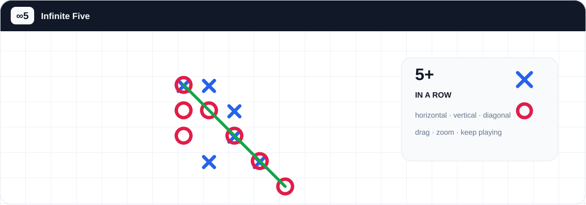

<div align="center">

# ∞5 INFINITE FIVE

### ПЯТЬ В РЯД · БЕСКОНЕЧНОЕ ПОЛЕ



[](https://github.com/StanleyLl0yd/infinite-five/actions/workflows/ci.yml)
[](https://github.com/StanleyLl0yd/infinite-five/actions/workflows/codeql.yml)
[](https://github.com/StanleyLl0yd/infinite-five/actions/workflows/security.yml)
[](https://stanleyll0yd.github.io/infinite-five/)
[](https://stanleyll0yd.github.io/infinite-five/)
[](https://www.typescriptlang.org/)
[](package.json)
[](LICENSE)

[](README.md)
[](README_RU.md)

Минималистичная игра «пять в ряд» на практически бесконечном поле — в браузере, на компьютере и телефоне.

[**▶ Играть сейчас**](https://stanleyll0yd.github.io/infinite-five/)

</div>

**Infinite Five** сохраняет классическую механику крестиков-ноликов, но убирает границы обычного поля: X и O ставятся на свободные клетки бесконечной сетки, а побеждает первый игрок, собравший пять или больше своих знаков подряд.

Текущий опубликованный релиз: **v0.6.2** · Web + PWA · GitHub Pages + подписанные нативные release-файлы. v0.6.2 обновляет иконку приложения для Web/PWA и нативных платформ из единого утверждённого raster source of truth; v0.6.1 остаётся первым нативным релизом, собранным из authoritative Rust game core после финального trust-boundary и release hardening. Rust проверяет историю партии, границы количества ходов/координат и внешние параметры AI-поиска; Rust-зависимости проверяются через RustSec; production web/native pipeline сохраняет WASM optimization, проверки утечек source/debug-артефактов, Android R8/resource shrinking и совместимость с 16 KB memory pages. Android остаётся на `minSdk 26`, `targetSdk 36`, `compileSdk 36`, NDK r29 и ARM-only ABI (`arm64-v8a` + `armeabi-v7a`). macOS остаётся universal DMG с ad-hoc подписью до появления Developer ID signing/notarization.

## 🎯 Правила

1. **X ходит первым.**
2. Игроки по очереди ставят X и O на свободные клетки.
3. Поле не имеет фиксированных границ.
4. Побеждает тот, кто первым соберёт **5 или больше** своих знаков подряд.
5. Победная линия может быть горизонтальной, вертикальной или диагональной.
6. После завершения партии можно сразу начать новую игру.

> Никаких уровней, ресурсов, усилителей и мета-механик — только поле, два знака и пять в ряд.

## ✨ Что уже работает

- бесконечное Canvas-поле с отрисовкой только видимого окна для стабильной работы длинных партий;
- режим **против компьютера** с уровнями Легко, Средне, Сложно и **Эксперт**;
- усиленная тактика Среднего и Сложного уровней, включая явную защиту от вилок;
- Эксперт объединяет пять атакующих, защитных и пространственных профилей, распознаёт двойные угрозы и использует итеративный alpha-beta поиск;
- расчёт AI выполняется в Web Worker и не блокирует интерфейс поля;
- детерминированный набор AI-регрессий, диагностика поиска и короткие self-play проверки Эксперт ↔ Сложно;
- выбор стороны X, O или случайной стороны против компьютера;
- локальная игра **два игрока** на одном устройстве;
- определение победы при 5+ знаках, подсветка последнего хода, анимация победной линии и акцент на выигрышной комбинации;
- управление полем с клавиатуры: стрелки, `Enter`/`Space`, `Home`, `+` и `-`;
- видимый фокус, локализованные подсказки для assistive technology и поддержка reduced motion;
- после партии доступны новая игра, повтор и отправка ссылки; Back/Escape корректно закрывают модальные окна;
- отмена хода против AI и накопительная локальная статистика побед, поражений и процента побед;
- локальная история **20 последних завершённых партий** с повтором, когда партия помещается в компактный формат;
- сохранение незаконченной партии с выбором «Продолжить / Новая игра»;
- пошаговый повтор завершённых, полученных по ссылке и сохранённых в истории партий;
- компактные ссылки, восстанавливающие последовательность ходов без backend;
- системная, светлая и тёмная темы плюс быстрый переключатель;
- автоматический русский/английский язык и ручной выбор языка;
- опциональный звук результата и разные виброотклики для хода, занятой клетки и результата;
- защищённый touch-ввод: отменённые жесты не создают ход, порог drag адаптируется к масштабу, pinch/drag остаются стабильными;
- постоянные мобильные кнопки с touch-target не меньше 44 px, отдельным компактным рядом и режимом для низкого landscape-экрана;
- устанавливаемая PWA с офлайн-готовностью и уведомлением о новой версии;
- автоматическая защищённая публикация на GitHub Pages;
- общая оболочка Tauri 2 для проверки Android/macOS-пакетов без разветвления игрового ядра;
- AAB-first release-сборка Android из GitHub Secrets с проверкой сертификатов/Application ID, `arm64-v8a` + `armeabi-v7a` и обязательной 16 KB native-совместимостью;
- дополнительный подписанный APK для прямой установки и GitHub Releases;
- universal DMG для macOS с ad-hoc подписью до появления Developer ID signing/notarization.

## 🕹 Управление

| Действие | Компьютер / клавиатура | Телефон / планшет |
| --- | --- | --- |
| Поставить знак | Клик, `Enter` или `Space` | Короткий тап |
| Переместить поле | Перетаскивание или стрелки для курсора клетки | Перетаскивание одним пальцем |
| Масштаб | Колесо мыши или `+` / `-` | Pinch двумя пальцами |
| Вернуться к последнему ходу | `К ходу` или `Home` | `◎` |
| Отменить ход против AI | `Отменить` | `↶` |
| История | `История` | `☷` |
| Настройки | `Настройки` | `⚙` |
| Новая партия | `Новая игра` | `＋` |
| Повтор партии | Назад / Вперёд | `←` / `→` |

Координаты игрового состояния не зависят от положения камеры: перемещение и масштабирование никогда не изменяют реальные клетки партии.

## 🤖 Уровни AI

| Уровень | Поведение |
| --- | --- |
| Легко | Видит прямые выигрыши, но допускает намеренные ошибки и не всегда блокирует угрозу |
| Средне | Надёжно обрабатывает немедленную тактику и лучше выбирает позиционные ходы |
| Сложно | Шире перебирает тактические кандидаты, защищается от вилок, создаёт свои и оценивает лучшие ответы соперника |
| Эксперт | Пересекает пять профилей оценки, использует воспроизводимый порядок близких вариантов, ищет двойные угрозы обеих сторон и выполняет итеративный alpha-beta поиск |

Поиск Эксперта ограничен временем, глубиной и шириной дерева. Production Web Worker получает больший бюджет, чем синхронный fallback. Более глубокая итерация используется только после оценки всех корневых кандидатов на этой глубине.

Повторяемые ошибки Сложного и Эксперта превращаются в постоянные regression-тесты. Подход описан в [`docs/AI_LAB.md`](docs/AI_LAB.md).

## ♿ Доступность и производительность

Canvas-поле можно сфокусировать и полностью использовать с клавиатуры. Стрелки перемещают видимый курсор между клетками, `Enter` или `Space` ставят знак, `Home` возвращает к последнему ходу, а `+`/`-` меняют масштаб. Эти действия имеют локализованные подсказки для вспомогательных технологий, а анимация результата учитывает `prefers-reduced-motion`.

При отрисовке длинной партии приложение не перебирает всю историю ходов на каждом кадре: Canvas запрашивает только занятые клетки текущего видимого диапазона. Частые события панорамирования и масштабирования объединяются через `requestAnimationFrame`. Regression-тест проверяет ограниченный запрос на позиции с 5 000 сохранённых ходов. Правила профилирования описаны в [`docs/PERFORMANCE.md`](docs/PERFORMANCE.md).

## 🕘 Локальная история

В локальном хранилище сохраняется до 20 последних завершённых партий. Для каждой записываются результат, количество ходов, время и сложность AI, если партия была против компьютера. Для AI также показывается локальный процент побед.

Партии, которые помещаются в существующий компактный формат обмена, можно открыть в пошаговом повторе прямо из истории. Очень длинная партия сохраняется как результат и статистика без чрезмерно большого replay payload. История остаётся локальной, а просмотр старой партии не перезаписывает текущую сохранённую игру.

## 🌐 Web и PWA

Официальная версия опубликована по адресу:

**https://stanleyll0yd.github.io/infinite-five/**

Сайт можно установить как PWA через поддерживаемый браузер. Service Worker кэширует оболочку приложения для запуска без сети. Если готова новая версия, интерфейс предлагает обновиться вместо бесконечного использования старого кэша.

Нет аккаунта, backend, аналитики, рекламы или трекинга. Текущая партия, настройки, локальная AI-статистика и история последних партий хранятся только в `localStorage` браузера. Партии для обмена кодируются во фрагмент URL и не отправляются на сервер.

## 🧩 Кроссплатформенная основа

Тот же TypeScript/Vite-интерфейс упаковывается нативно через **Tauri 2**, а правила поля, проверка победы и AI находятся в едином Rust core. В Web этот core выполняется как WebAssembly, а нативные сборки вызывают ту же Rust-реализацию через Tauri command. Нативные пакеты содержат frontend внутри приложения и не используют GitHub Pages как основной интерфейс. Для нативной сборки PWA-генерация отключается, поэтому обновление Service Worker в браузере отделено от обновлений APK/приложения через магазин или другой канал распространения.

Стабильный Application ID / Bundle ID нативного приложения — **`com.sl.infinitefive`**. Конфигурация Tauri, Android Gradle namespace/applicationId, Kotlin package paths, тесты, workflows и документация должны оставаться синхронизированы с этим идентификатором.

Планируемый порядок публичного распространения: сначала Android через **RuStore**, затем macOS с возможностью прямого распространения, а iOS и дополнительные Android-магазины — по мере появления необходимого доступа. Нативные release-файлы прикладываются к соответствующему GitHub Release вместе с SHA-256 checksums. APK/AAB подписываются из GitHub Secrets; текущий macOS DMG имеет ad-hoc подпись и пока не нотарифицирован Developer ID. Kotlin/Swift-код используется только для платформенных интеграций: lifecycle, share, haptics, подпись, store updates и подобное. Правила игры, проверка победы и AI остаются общими в Rust core и не дублируются в TypeScript или платформенном коде.

Подробности, идентификатор приложения и требования к проверке нативных сборок — в [`docs/CROSS_PLATFORM.md`](docs/CROSS_PLATFORM.md).

## 🧱 Технологии

| Категория | Технология |
| --- | --- |
| Языки | TypeScript 7.0 + Rust |
| Отрисовка | HTML5 Canvas |
| Выполнение AI | Rust core через WebAssembly Web Worker / Tauri command |
| Сборка | Vite 8 |
| PWA | vite-plugin-pwa / Workbox |
| Нативная оболочка | Tauri 2 / Rust |
| Тесты | Vitest 4 |
| Хранение | localStorage-совместимое локальное хранилище |
| Обмен партиями | URL fragment |
| Хостинг | GitHub Pages |
| CI/CD | GitHub Actions |

Авторитетный Rust game core отделён от Canvas-отрисовки и платформенной оболочки. TypeScript отвечает за UI, render cache, persistence и sharing, а правила, проверка победы и AI тестируются в Rust и переиспользуются на поддерживаемых платформах. На границе core восстановленная партия ограничена 2 000 ходами и координатами ±1 000 000; внешние time/depth параметры AI ограничиваются безопасными пределами без изменения production-настроек сложности, а невозможная история с ходами после победы отклоняется.

## 🗂 Архитектура

```text
crates/game-core/
├── src/ai.rs              оценка AI, тактика и ограниченный поиск
├── src/board.rs           авторитетное разреженное состояние поля
├── src/win.rs             проверка победной линии
├── src/types.rs           общие типы game core
└── src/lib.rs             JSON dispatch API для WebAssembly и Tauri

src/
├── game/
│   ├── ai.ts              type-only compatibility facade AI
│   ├── ai-client.ts       асинхронная маршрутизация AI
│   ├── ai.worker.ts       WebAssembly AI worker
│   ├── core-client.ts     общий bridge к Rust core
│   ├── core-wasm.ts       загрузчик WebAssembly для браузера
│   ├── board.ts           render cache и запросы видимого диапазона
│   ├── history.ts         ограниченная локальная история партий
│   ├── share.ts           компактное кодирование партии в URL
│   └── types.ts           frontend/transport типы
├── ui/
│   └── canvas-board.ts    Canvas, жесты, клавиатура и анимация победы
├── i18n.ts                русский / английский интерфейс
├── main.ts                состояние приложения, история, настройки и повтор
├── native-config.test.ts  regression идентификатора и Android package paths
└── styles.css             визуальный слой, доступность и адаптивная вёрстка

src-tauri/
├── src/                    оболочка Tauri и command bridge к Rust core
├── capabilities/           политика нативных разрешений Tauri
├── gen/android/            сгенерированный Android-проект
├── icons/                  нативные иконки платформ
├── Cargo.toml / Cargo.lock Rust-зависимости
└── tauri.conf.json         кроссплатформенная конфигурация Tauri
```

Подробная продуктовая спецификация находится в [`docs/PRODUCT.md`](docs/PRODUCT.md), кроссплатформенные правила — в [`docs/CROSS_PLATFORM.md`](docs/CROSS_PLATFORM.md), правила настройки AI — в [`docs/AI_LAB.md`](docs/AI_LAB.md), а профилирование длинных партий — в [`docs/PERFORMANCE.md`](docs/PERFORMANCE.md).

## 🛠 Разработка

Для Web нужны:

- Node.js 22 или другая версия, поддерживаемая текущим Vite;
- npm;
- актуальный стабильный Rust toolchain. Для production Web-сборки также нужен Binaryen (`wasm-opt`).

```bash
git clone https://github.com/StanleyLl0yd/infinite-five.git
cd infinite-five
npm ci
npm run dev
```

Основная локальная проверка:

```bash
npm audit --audit-level=high
npm test
npm run build
cargo audit --file crates/game-core/Cargo.lock
cargo audit --file src-tauri/Cargo.lock
```

Для отдельного запуска AI Lab:

```bash
npm run test:ai-lab
```

Для нативной разработки дополнительно нужны prerequisites Tauri и toolchain целевой платформы. Основные команды:

```bash
npm run tauri:dev
npm run tauri:build
npm run tauri:android:build
```

Закоммиченные npm- и Cargo-lockfile обеспечивают воспроизводимое разрешение зависимостей. Production Web build включает TypeScript-проверку перед сборкой Vite.

## ✅ Проверки качества

Push и pull request автоматически проходят GitHub Actions:

- воспроизводимая установка зависимостей через `npm ci`;
- блокирующий npm audit для high и critical уязвимостей;
- unit- и regression-тесты Vitest для поля, истории, обмена партиями, локализации, нативного идентификатора, тактики AI и AI Lab;
- regression-тест ограниченной отрисовки на состоянии с 5 000 ходов;
- TypeScript-проверка и production build;
- проверка сборки Android AAB/APK и universal macOS DMG для нативных изменений;
- CodeQL с `security-extended`;
- Semgrep с правилами безопасности и поиска секретов;
- Gitleaks с проверкой полной истории Git.

Отдельный усиленный workflow повторно проверяет сборку и публикует GitHub Pages после изменений в `main`. Нативные package checks подтверждают совместимость упаковки. Release workflow дополнительно проверяет подписи Android, `com.sl.infinitefive`, SDK levels, ABI, ELF LOAD alignment не менее 16 KB, APK zip alignment 16 KB и AAB `PAGE_ALIGNMENT_16K`; основным Android-артефактом публикуется подписанный AAB, дополнительным — подписанный APK, вместе с ad-hoc подписанным universal DMG и SHA-256 checksums.

## 🔐 Безопасность

Защита репозитория построена на принципе минимальных привилегий и защите цепочки поставки:

- включены GitHub Secret Scanning и Push Protection;
- Dependabot отслеживает npm-зависимости и GitHub Actions;
- `GITHUB_TOKEN` по умолчанию имеет только права чтения, а workflow запрашивают только необходимые разрешения;
- сторонние GitHub Actions закреплены полными commit SHA;
- Verify, CodeQL, Semgrep и Gitleaks являются обязательными проверками для `main`;
- активный ruleset `Protect main` требует pull request, linear history, закрытия review threads и squash merge, запрещая force-push и удаление основной ветки.

Уязвимости нужно сообщать только приватно, не через публичный issue. Порядок описан в [`SECURITY.md`](SECURITY.md).

## 🌍 Языки

- **Авто** — русский, если он присутствует среди языков браузера/системы; иначе английский;
- **Русский** — ручной выбор;
- **English** — ручной выбор.

Выбранный язык применяется к правилам, режимам, сложности, настройкам, кнопкам, статусам, подсказкам доступности, истории, повтору, обмену партией и окнам результата.

## 🗺 Дальнейшее развитие

В **v0.5.0** завершены: общая нативная оболочка Tauri 2, стабильный идентификатор приложения `com.sl.infinitefive`, сгенерированный Android-проект, regression-проверка идентификатора и package-build проверка Android/macOS.

В **v0.5.1** завершены: подпись Android из GitHub Secrets, проверенная release-сборка APK/AAB, universal DMG для macOS, checksums и автоматическое добавление нативных файлов в GitHub Release.

В **v0.5.2** завершены: полный аудит/рефакторинг репозитория, усиление release-source verification, минимизация Android manifest для RuStore, синхронизация release-метаданных, checklist публикации, политика конфиденциальности, пользовательские условия и первый RuStore release candidate.

В **v0.5.3** завершены: компактная локализованная кнопка/панель About с версией приложения, разработчиком и ссылками на GitHub, политику конфиденциальности и условия использования.

В **v0.5.4** завершены: Android 8.0+ (`minSdk 26`), target/compile API 36, NDK r29, AAB-first release pipeline, ARM-only production ABI и обязательные проверки совместимости ELF/APK/AAB с 16 KB memory pages.

В **v0.6.0** завершены: mobile/touch UX hardening, безопасная отмена жестов, нормализованный wheel zoom, плавное центрирование, анимация последнего хода, расширенный haptic feedback, Back/Escape-aware диалоги, 44 px мобильные touch-targets, compact landscape и отдельные UX-регрессии.

Следующие приоритеты:

- завершить RuStore AAB signing enrollment, smoke-тест release-сборки на реальном устройстве, подготовить медиаматериалы/формы и отправить v0.6.0 на модерацию;
- подготовить прямое распространение macOS, а при наличии доступа — Developer ID signing и notarization;
- добавить Google Play и iOS/App Store после появления необходимого developer-доступа;
- продолжать пополнять набор AI-регрессий реальными позициями и оптимизировать только подтверждённые узкие места;
- позже — опциональный онлайн-режим по ссылке на комнату между поддерживаемыми платформами без изменения базовых правил.

## 📄 Лицензия

Copyright © 2026 **Stanley Lloyd**. Все права защищены.

Репозиторий опубликован для просмотра исходного кода. Публичная доступность **не даёт разрешения** копировать, изменять, адаптировать, переводить, распространять, публиковать, размещать зеркала, создавать производные работы, включать код в другие продукты или иным образом использовать содержимое репозитория.

Разрешено пользоваться только официально опубликованной версией Infinite Five как конечному пользователю. Любое другое использование требует предварительного письменного разрешения правообладателя. Полный текст — в [`LICENSE`](LICENSE).

## 👨‍💻 Автор

**Stanley Lloyd** · [@StanleyLl0yd](https://github.com/StanleyLl0yd)

---

<div align="center">

**X · O · X · O · 5 В РЯД · ∞**

</div>
